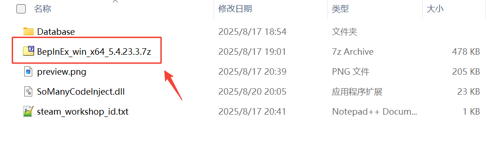
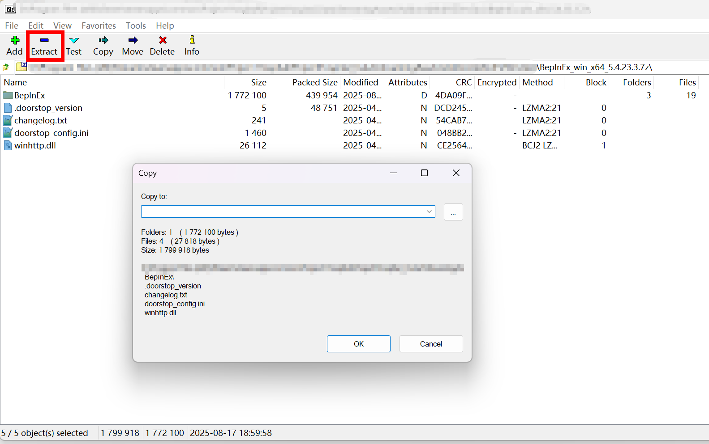
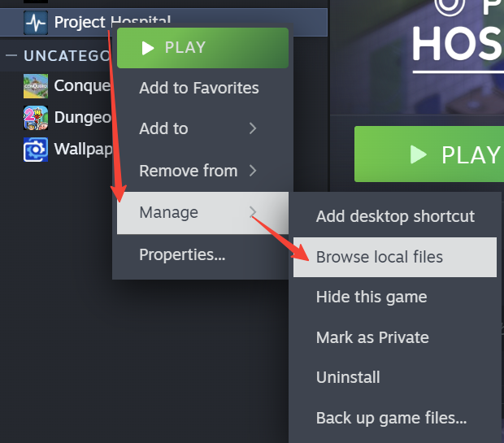
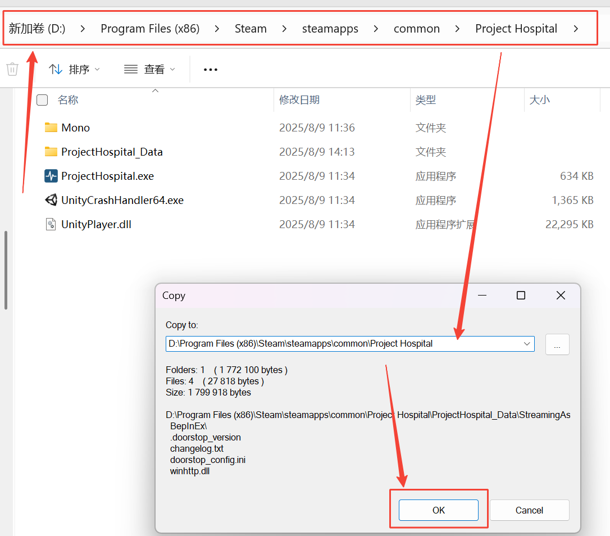
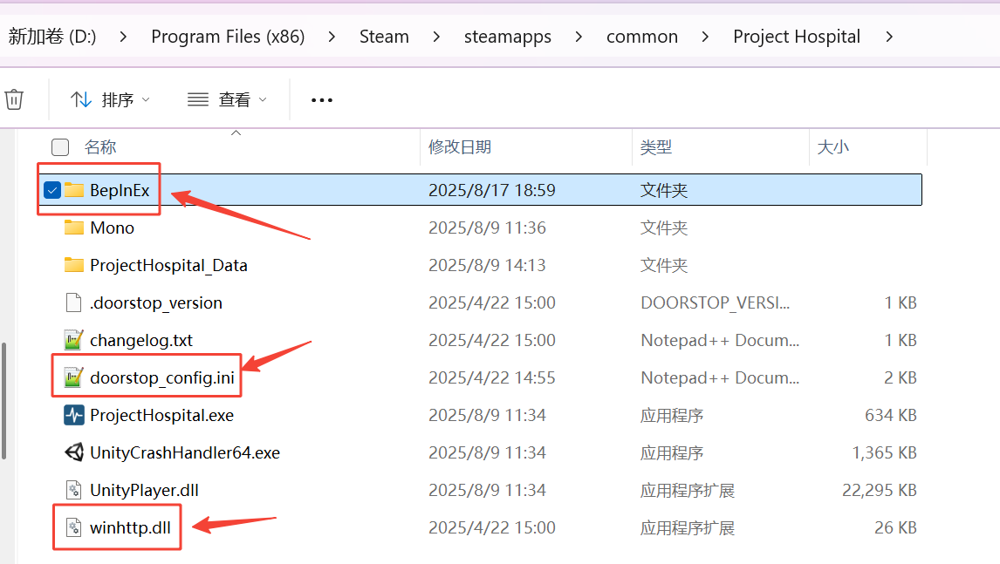
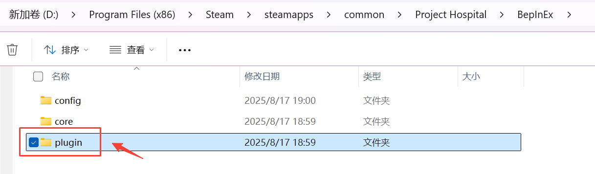

## Introduction 
This is a tutorial on how to enable the BepInEx framework in the game, Project Hospital.
## Steps
 - First, you should find the file BepInEx_win_x64_5.4.23.3.7z and double-click it to open it. The compression software I used is **7-zip**, which you can download from [here](https://www.7-zip.org/).
   - 
 - Use the keyboard shortcut `Ctrl + A` to quickly select all files in the opened window. Then click the "**Extract**" button on the toolbar to prepare for decompression.
   - 
 - Now go back to the Steam Library interface, right-click the game, select "Manage" in the pop-up drop-down menu, and then click the "Browse local files" option.
   - 
 - In the newly opened window, copy the absolute path in the address bar to the decompression destination input box of 7-zip. Finally, click the "OK" button to execute the decompression operation.
   - 
 - In the game's main directory, confirm the presence of the `winhttp.dll` file, `doorstop_config.ini` file, and `BepInEx` directory. Then, double-click to enter the **BepInEx** directory.
   - 
 - Find the **plugins** directory and double-click it to enter it. If you can't find it, create a new one.
   - 
     > **Note:** The directory name shown in the image above was labeled as `plugin` (singular) — this was a typo in the earlier version of this guide. The correct directory name should be `plugins` (plural). Sorry for the confusion!
 - Assume that the mod description asks you to copy `SoManyCodeInject.dll`. Then find it and copy it directly to the **plugins** directory you just opened.
   - 
 - Enjoy the game!
